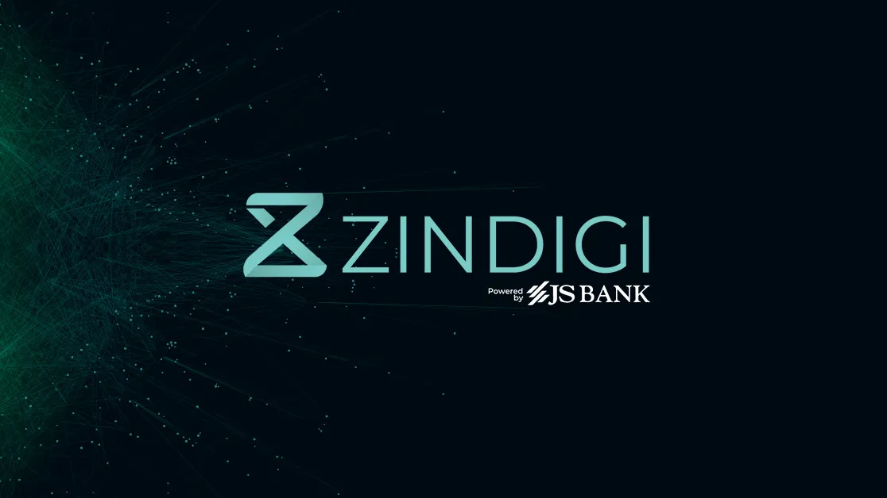

<p align="center">
    
</p>

<h1 align="center">Zindagi Z-Connect Laravel SDK</h1>

<p align="center">
    <a href="https://packagist.org/packages/zfhassaan/zindagi-zconnect">
        
    </a>
    <a href="https://github.com/zfhassaan/zindagi-zconnect/actions/workflows/tests.yml">
        
    </a>
    <a href="https://packagist.org/packages/zfhassaan/zindagi-zconnect">
        
    </a>
    <a href="https://packagist.org/packages/zfhassaan/zindagi-zconnect">
        
    </a>
    <a href="https://packagist.org/packages/zfhassaan/zindagi-zconnect">
        
    </a>
    <a href="https://github.com/zfhassaan/zindagi-zconnect/blob/main/LICENSE">
        
    </a>
    <a href="https://github.com/zfhassaan/zindagi-zconnect">
        
    </a>
</p>

<p align="center">
    A clean, fully-typed Laravel package to integrate with <strong>JS Bank’s Z-Connect API</strong> -- the official fintech API platform for <strong>Zindigi digital banking services</strong>.
</p>

---

## Disclaimer

This is an **unofficial** Laravel package for integrating with **JS Bank’s Z-Connect (Zindigi) API**.

This repository is **not owned, maintained, or endorsed by JS Bank or Zindigi**. All trademarks, logos, APIs, and systems belong to their respective owners.

This package is provided **solely to assist developers** in streamlining the integration process with the official Z-Connect APIs.  
For authoritative documentation, credentials, and production usage, refer to the official JS Bank developer portal:  
 https://developer.jsbl.com

---

## Features

- **Onboarding Solution** — Complete customer onboarding workflow with verification
- **Account Verification** — CNIC & mobile-based account checks
- **Account Statement V2 / Digi Wallet Statement**
- **Audit Trail & Logging**
- **DTO-driven request/response validation**
- **Modular & extensible architecture**

> Inquiry, Payment, and Lending modules are planned.

---

## Requirements

- PHP >= 8.1
- Laravel >= 10
- Guzzle HTTP Client

---

## Installation

```bash
composer require zfhassaan/zindagi-zconnect
```

---

## Configuration

### Publish config

```bash
php artisan vendor:publish --tag=zindagi-zconnect-config
```

### Environment variables

```env
ZINDAGI_ZCONNECT_BASE_URL=https://api.jsbank.com/zconnect
ZINDAGI_ZCONNECT_CLIENT_ID=your_client_id
ZINDAGI_ZCONNECT_CLIENT_SECRET=your_client_secret
ZINDAGI_ZCONNECT_API_KEY=your_api_key
ZINDAGI_ZCONNECT_ORGANIZATION_ID=223
ZINDAGI_ZCONNECT_MERCHANT_TYPE=0088
ZINDAGI_ZCONNECT_COMPANY_NAME=NOVA
```

### (Optional) Migrations

```bash
php artisan vendor:publish --tag=zindagi-zconnect-migrations
php artisan migrate
```

---

## Usage

### Onboarding (Facade)

```php
use zfhassaan\ZindagiZconnect\Facades\ZindagiZconnect;
use zfhassaan\ZindagiZconnect\Modules\Onboarding\DTOs\OnboardingRequestDTO;

$dto = OnboardingRequestDTO::fromArray([
    'cnic' => '1234567890123',
    'full_name' => 'John Doe',
    'mobile_number' => '03001234567',
    'email' => 'john@example.com',
    'date_of_birth' => '1990-01-01',
    'address' => '123 Main Street',
    'city' => 'Karachi',
    'country' => 'Pakistan',
]);

$response = ZindagiZconnect::onboarding()->initiate($dto);
```

---

## Events

The package emits domain events:

- `OnboardingInitiated`
- `OnboardingVerified`
- `OnboardingCompleted`
- `AccountVerified`

```php
Event::listen(AccountVerified::class, function ($event) {
    Log::info('Account verified', [
        'trace_no' => $event->verification->trace_no,
    ]);
});
```

---

## Validation Helpers

```php
ValidationHelper::validateCnic('1234567890123');
ValidationHelper::validateMobileNumber('03001234567');
```

---

## Audit Trail

```php
$logs = ZindagiZconnect::audit()->getLogs(
    ['module' => 'onboarding'],
    limit: 50
);
```

---

## Security

- Encrypted API communication
- Sensitive data masking
- Request & response validation
- Centralized credential handling
- Optional signature verification

---

## Architecture

```
src/
├── Modules/
│   ├── Onboarding/
│   ├── Inquiry/        (Planned)
│   ├── Payment/        (Planned)
│   └── Lending/        (Planned)
├── Services/
├── DTOs/
├── Events/
├── Helpers/
└── Exceptions/
```

---

## Quality & Testing

This package maintains high code quality standards:

- ✅ **294 comprehensive unit tests** covering all modules and services
- ✅ **1154+ assertions** ensuring robust functionality
- ✅ **Continuous Integration** via GitHub Actions
- ✅ **Multi-version testing** across PHP 8.2, 8.3 and Laravel 10, 11, 12
- ✅ **Code style enforcement** using Laravel Pint
- ✅ **Type-safe DTOs** for all API requests and responses
- ✅ **100% test coverage** for critical business logic

### CI/CD Pipeline

Every commit is automatically tested against:

- PHP 8.2, 8.3
- Laravel 10.x, 11.x, 12.x
- SQLite in-memory database
- Multiple dependency versions (prefer-lowest, prefer-stable)

---

## Testing

Run the test suite locally:

```bash
composer test
# or
vendor/bin/phpunit
```

Run tests with coverage:

```bash
composer test-coverage
```

Format code with Laravel Pint:

```bash
composer format
```

---

## License

MIT

---

## Support

For bugs or feature requests, please open an issue on [GitHub](https://github.com/zfhassaan/zindagi-zconnect/issues).

---

## Contributing

Contributions are welcome! Please feel free to submit a Pull Request.
